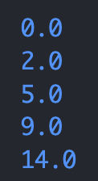

## Part 1:

## Part 2: averageWithoutLowest
---
A failure-inducing input for the buggy program, as a JUnit test and any associated code
---
`@Test
  public void testAWLSameNum() {
    double[] input1 = {5, 5, 5};
    assertEquals(5, ArrayExamples.averageWithoutLowest(input1), 0.001);
  }`
 ---
An input that doesn’t induce a failure, as a JUnit test and any associated code
---
`@Test
  public void testReversed() {
    int[] input1 = {1, 2, 3, 4, 5};
    assertArrayEquals(new int[]{5, 4, 3, 2, 1}, ArrayExamples.reversed(input1));
  }`
 ---
The symptom, as the output of running the tests
---
- Image of testReversed
- 

- Image of testAWLSameNum
- 

The bug, as the before-and-after code change required to fix it
---

## Part 3:
