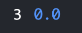

## Part 1: String Server Web Server

## Part 2: averageWithoutLowest Bug
---

- A failure-inducing input for the buggy program, as a JUnit test and any associated code

---
```
  @Test
  public void testAWLSameNum() {
    double[] input1 = {5, 5, 5};
    assertEquals(5, ArrayExamples.averageWithoutLowest(input1), 0.001);
  }
```
---
 
- An input that doesn’t induce a failure, as a JUnit test and any associated code

---
```
  @Test
  public void testReversed() {
    int[] input1 = {1, 2, 3, 4, 5};
    assertArrayEquals(new int[]{5, 4, 3, 2, 1}, ArrayExamples.reversed(input1));
  }
```
 ---
 
The symptom, as the output of running the tests
- Image of testReversed
- 

- Image of testAWLSameNum
- 

The bug, as the before-and-after code change required to fix it
- Before

---
```
static double averageWithoutLowest(double[] arr) {
    if(arr.length < 2) { return 0.0; }
    double lowest = arr[0];
    for(double num: arr) {
      if(num < lowest) { lowest = num; }
    }
    double sum = 0;
    for(double num: arr) {
      if (num != lowest) {sum += num;}
    }
    
    return (sum) / (arr.length - 1);
  }
```
  
 ---
  
 - After

---
```
 static double averageWithoutLowest(double[] arr) {
    if(arr.length < 2) { return 0.0; }
    double lowest = arr[0];
    for(double num: arr) {
      if(num < lowest) { lowest = num; }
    }
    double sum = 0;
    for(double num: arr) {
      sum += num;
    }
    
    return (sum - lowest) / (arr.length - 1);
  }
```
---

## Part 3: What did I learn in weeks 2 and 3?
- The most important topics that I have learned during these weeks are using remote servers and using command lines. I have coded before so I was used to other topics such as bugs and symptoms because. The new topics such as using github to create repositories, scp to copy files from local to a remote server, and ssh to be able to access the remote server. 
